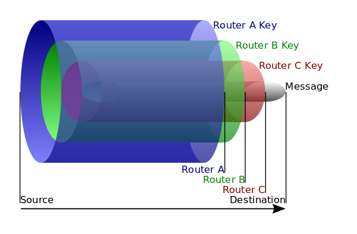
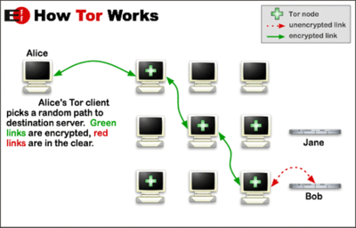

# lightweight_tor
A light weight implementation of "tor". Use relay nodes hosted on Duke VMs to anonymize your browsing.

## Background
TOR, an open source and free software designed to provide online anonymity. TOR’s name is derived from “The Onion Routing”.  It uses a voluntary network of several thousand voluntary relay server nodes in order to shield users from network surveillance and traffic analysis.

## Onion Routing
An onion has many layers, just like how an onion network has multiple layers of encryption surrounding messages. The client will encapsulate the message it is trying to send to the destination server with as many layers of encryption as there are intermediary nodes. This process is also called a stream cipher:

#### How Stream Ciphers Work


Each relay node only know its predecessor and successor and will not be able to see the plain-text message, with only the exit relay node being able to see the unencrypted message. However, the exit node will have no idea who the source of the message is. Additionally, there may be TLS infrastructure (such as HTTPS) between the exit node and destination server. Onion routing provides perfect forward secrecy between relays.

#### How Relay Nodes in TOR Work


Traditionally, Tor uses a stream cipher, a public-key cipher, the Diffie-Hellman protocol, and a hash function. For a stream cipher, Tor uses 128-bit AES in counter mode, with an IV of all 0 bytes. For a public-key cipher, Tor uses RSA with 1024- bit keys and a fixed exponent of 65537.

In our lightweight implementation, we omitted the Diffie-Hellman protocol for key exchange, but instead focused on the hybrid cryptosystem with stream ciphers for encoding messages and public key infrastructure for protecting private symmetric keys. To do this, we utilized a python [cryptography package](https://cryptography.io/en/latest/) that comes with helper methods to generate, encrypt, and decrypt in AES and RSA formats. In particular, we used the [Fernet helper class](https://cryptography.io/en/latest/fernet/) (based on AES with cipher block chaining, 128 bit key, os.urandom() for initialization vector, PKCS7 padding, and SHA256) from the package for symmetric encryption. For asymmetric encryption, we implemented RSA just like the actual TOR with 1024 bit keys and a fixed exponent of 65537. Our payloads (encrypted plain text message and IP of next node in circuit) are sent between in byte form.

A random circuit is generated for every request session. Assuming a client, a destination server, and 3 relay nodes  (Node 3 is the exit node, Node 2 is an intermediary node, Node 1 is the entry node), our onion layers would look like so:
```
Layer 1 = AES3{Destination domain in plaintext} + "###" +RSA{Node 3 AES Key}
Layer 2 = AES2{Layer 1 + Node 3 IP} + "###" +RSA{ Node 2 AES Key}
Layer 3 = AES1{Layer 2 + Node 2 IP} + "###" +RSA{ Node 1 AES Key}
```

Each node uses its private RSA key to unwrap a layer of the onion. The three “#”s are used to be able to split the payload into the AES and RSA encrypted components. The unwrapped RSA component will give the relay node its individual AES Key which only it and the client know. Using this AES Key, the relay node can decrypt the next layer to obtain the next encrypted layer and the next IP address in the circuit. When we reach the exit node, the decrypted layer will reveal the destination domain in plaintext.

For each relay node, it caches the unique AES key which is used later to send the response back to the client.

Once the exit node obtains the destination domain, it makes a HTTP request to it, and returns the response from the domain in HTML. It then begins the process of wrapping the response in reverse by encrypting it with its unique AES Key.

In reverse, the onion layer swould look like so:

```
Layer 1 = AES1{Destination domain response in HTML}
Layer 2 = AES2{Layer 1}
Layer 3 = AES3{Layer 2}
```

Eventually, `Layer 3` gets sent back to our client server and because it knows the unique sequence of our session-specific circuit, and the corresponding AES Keys, it can successfully decrypt the response from the destination to render the `HTML`.

## Getting Started
These instructions will get you a copy of the project up and running on your local machine for development and testing purposes.

### Prerequisites
You'll need the following to successfully install and run this project:
```
Python version >= 3.0
```

### Installing

1. Clone this repository and cd into it
```
git clone git@github.com:sfbaker7/lightweight_tor.git
cd lightweight_tor
```

2. Create a virtual environment for our project
```
# create a virtual env called "dev"
python3 -m venv dev

# activate our virtual environment
# note: you'll need to activate virtual env in every terminal / tmux tab
source dev/bin/activate
```

3. Install dependencies in our virtual environment
```
pip install -r requirements.txt
```

## Development
For the purposes of demonstration, we've configured all servers to be hosted on localhost such that you won't need multiple machines to test `lightweight_tor`. There are 5 servers that we need to get up and running in order to simulate the onion routing protocol:
1. `directory.py`
2. `relay_server.py`
3. `relay_server1.py`,
4. `relay_server2.py`,
5. `client_server.py`

You need to start up your `directory.py` server first before starting up any of the other servers, and start them in different terminal/tmux sessions in order of:
`directory -> relay servers -> client_server`.

When you finally run `./client_server.py <some_domain_name>`, assuming the other servers are up and running, it'll trigger a request to our onion network using the `<some_domain_name>` that was entered. For example, `./client_server.py https://facebook.com` will make a request via `lightweight_tor`, using the onion network, to `facebook.com`.

